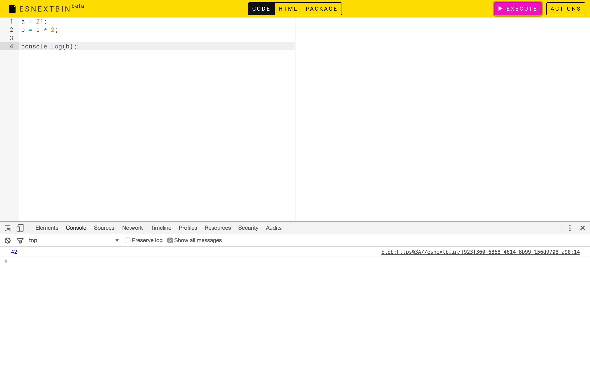

# Day 1

## Joining GitHub
[GitHub](https://github.com/) is like Google Docs for code.

## Reading
* You Don't Know JS: Up & Going
  * [Chapter 1: Into Programming](https://github.com/getify/You-Dont-Know-JS/blob/master/up%20&%20going/ch1.md)
    * Code
    * Try It Yourself

## Concepts

### Syntax
The **syntax** of a programming language is like the grammar of English.

### Statements
A **statement** is roughly like a complete sentence in English. For example, "the value of *b* multiplied by 2 is the value of *a*" is a statement.

### Expressions
An **expression** is something that represents a **value**. For example, in the aforementioned sentence, there are a total of four expressions:

* "the value of *b*"
* "2"
* "the value of *b* multiplied by 2"
* "the value of *b* multiplied by 2 is the value of *a*" - consider another way to say it: "the value of *a*, which is the value of *b* multiplied by 2"

## Trying Out
Open [ESNextbin](https://esnextb.in/) and enter code examples from the book, then click on the "Execute" button. Now open the console (⌥⌘I). The result should be something like this:

Try out the various examples provided by the book, and play around by substituting the numbers.

## Homework
Write a program that:

* Prompt the user to input a number
* Output the number cubed inside the console
